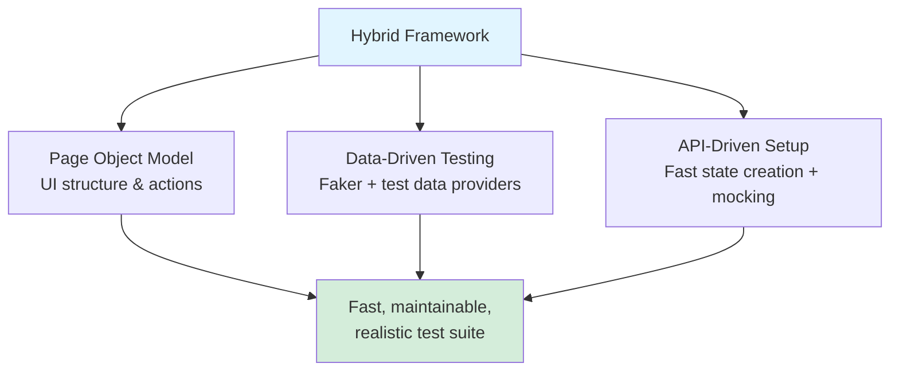
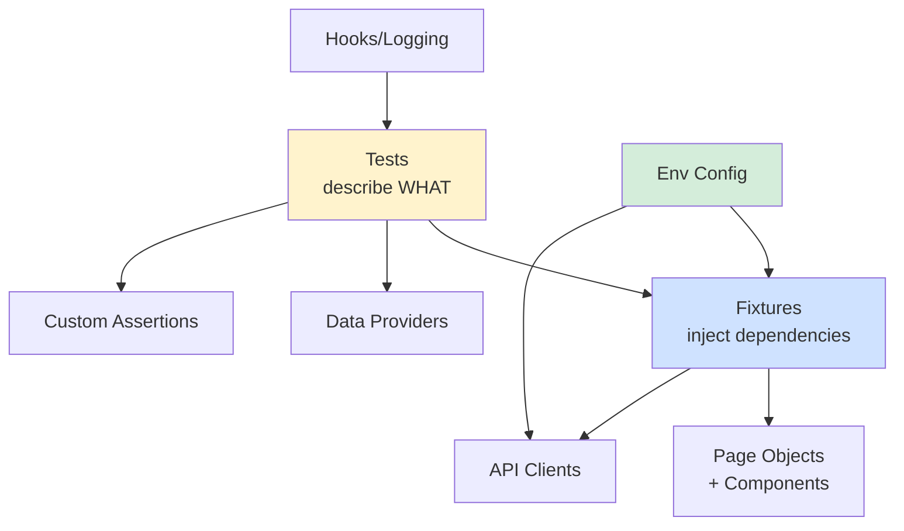

<div align="center" markdown="1">

# 🏗️ Framework Design with Playwright


**This is the module where you stop writing test scripts and start engineering a system. It's also the module that gets you hired over the other candidate who only has test scripts.**

</div>

---

## 📑 Table of Contents

- [Script Collection vs. Framework](#-script-collection-vs-framework)
- [The "Hybrid" Pattern, Named](#-the-hybrid-pattern-named)
- [Layered Architecture](#-layered-architecture)
- [Layer 1: Typed, Fail-Fast Configuration](#-layer-1-typed-fail-fast-configuration)
- [Layer 2: Custom Fixtures](#-layer-2-custom-fixtures-the-glue)
- [Layer 3: Data Providers](#-layer-3-data-providers)
- [Layer 4: Custom Domain Assertions](#-layer-4-custom-domain-assertions)
- [Layer 5: Hooks & Structured Logging](#-layer-5-hooks--structured-logging)
- [Putting It All Together](#-putting-it-all-together)
- [Design Patterns You Just Used (Without a Lecture)](#-design-patterns-you-just-used-without-a-lecture)
- [Hands-On Exercise](#-hands-on-exercise)
- [Common Mistakes](#-common-mistakes)
- [Next Steps](#-next-steps)

---

## 🤷 Script Collection vs. Framework

Here's the interview question that separates candidates: **"What's the difference between a
folder of Playwright tests and a test automation framework?"**

A bad answer: "A framework has more files."

The real answer: **a framework is a system where adding the 200th test is exactly as easy as
adding the 5th.** In a script collection, test 200 requires copy-pasting login logic, re-declaring
locators, hardcoding a new environment URL, and hoping nobody changes the auth flow. In a
framework, test 200 imports a fixture, calls a method, and is done in 4 lines — because the
config, auth, page objects, data, and assertions already exist as reusable layers.

That's this entire module in one sentence: **build the layers once, so every test after that is
cheap.**

---

## 🎯 The "Hybrid" Pattern, Named

Every framework you've partially seen pieces of across Modules 03-05 — Page Object Model
(Module 03), API clients for data setup (Module 04), reusable UI components (Module 05) — has a
name when combined: the **Hybrid Framework** pattern. It's called "Hybrid" because it fuses three
approaches that are often taught as separate, competing choices:



This isn't an academic distinction. It's the actual pattern used in the real production framework
this module is built from
([`playwright-starter-framework`](https://github.com/ghanendra-sdet/playwright-starter-framework))
— POM for structure, Faker-driven data providers for realistic inputs, and API clients for setup
and teardown. You've already learned all three pieces. This module is about wiring them together
properly.

---

## 🏛️ Layered Architecture



Each layer has exactly one job. A test file should almost never contain a raw locator, a raw
`fetch`, or a hardcoded URL — those all belong in a lower layer. If you find yourself writing
`page.locator('.some-class')` directly inside a `test()` block in a mature framework, that's a
signal a Page Object or component is missing, not a shortcut worth taking.

---

## ⚙️ Layer 1: Typed, Fail-Fast Configuration

Hardcoding URLs and credentials is the fastest way to make a framework unusable by anyone but you.
The fix is a single typed config object, loaded once, that **fails immediately and loudly** if
something required is missing — instead of failing 20 minutes into a test run with a cryptic
"cannot read property of undefined."

```typescript
export interface EnvConfig {
  baseUrl: string;
  env: string;
  merchantUsername: string;
  merchantPassword: string;
  apiBaseUrl: string;
  logLevel: string;
}

function requireEnv(name: string): string {
  const value = process.env[name];
  if (!value) {
    throw new Error(
      `❌ Required environment variable "${name}" is not set.\n` +
      `   Copy .env.example → .env and fill in the values.`
    );
  }
  return value;
}

function optionalEnv(name: string, fallback: string): string {
  return process.env[name] ?? fallback;
}

export const envConfig: EnvConfig = {
  baseUrl: requireEnv('BASE_URL'),        // missing this? Crash NOW, with a clear message.
  env: optionalEnv('ENV', 'dev'),
  merchantUsername: optionalEnv('MERCHANT_USERNAME', ''),
  merchantPassword: optionalEnv('MERCHANT_PASSWORD', ''),
  apiBaseUrl: optionalEnv('API_BASE_URL', ''),
  logLevel: optionalEnv('LOG_LEVEL', 'info'),
};
```

> [!TIP]
> **"Fail fast" is a design philosophy, not just error handling.** A missing `BASE_URL` that
> silently defaults to `undefined` will produce a confusing wall of "navigation failed" errors
> across 200 tests. A `requireEnv()` that throws immediately at startup, with a message telling
> you exactly what's missing and how to fix it, saves whoever runs this framework next (possibly
> you, six months from now, at 11pm before a release) from a very bad debugging session.

Multi-environment support (dev/staging/prod) is a layered `.env` loading order, not a `switch`
statement scattered through your code:

```typescript
const environment = process.env.ENV ?? '';
if (environment) {
  const envFile = path.resolve(__dirname, 'environments', `${environment}.env`);
  if (fs.existsSync(envFile)) dotenv.config({ path: envFile });
}
dotenv.config({ path: path.resolve(__dirname, '.env') }); // layered on top, doesn't overwrite
```

```bash
ENV=staging npx playwright test    # loads staging.env, falls back to .env for anything missing
ENV=prod npx playwright test       # same test suite, different environment, zero code changes
```

---

## 🧵 Layer 2: Custom Fixtures (The Glue)

This is the layer that makes tests read like plain English instead of setup boilerplate.
Playwright's `test.extend()` lets you declare **custom fixtures** — dependencies that get
automatically created and injected into every test that asks for them:

```typescript
import { test as base } from '@playwright/test';
import LoginPage from '../pages/common/LoginPage';
import CollectionTransactionPage from '../pages/collection/TransactionPage';

type PaywizeFixtures = {
  loginPage: LoginPage;
  collectionTransactionPage: CollectionTransactionPage;
};

export const test = base.extend<PaywizeFixtures>({
  loginPage: async ({ page }, use) => {
    await use(new LoginPage(page));
  },
  collectionTransactionPage: async ({ page }, use) => {
    await use(new CollectionTransactionPage(page));
  },
});

export { expect } from '@playwright/test';
```

Now every test file imports `test` from **this** file instead of `@playwright/test` directly, and
gets fully-constructed page objects for free — no `new LoginPage(page)` boilerplate in every test:

```typescript
import { test, expect } from '../../src/fixtures/base.fixture';

test('search transaction by ID', async ({ collectionTransactionPage }) => {
  //                                     ^^^^^^^^^^^^^^^^^^^^^^^^^^^^^^
  // Already constructed. Already has its own `page`. Zero setup lines needed.
  await collectionTransactionPage.searchTransaction('TXN-001');
});
```

The real framework wires up **seventeen** page objects this exact way in one file
(`base.fixture.ts`) — every single test in the entire suite gets instant access to any page object
it needs, with zero repeated construction code. That's the payoff of this layer: write the
fixture once, use it in 200 tests for free.

---

## 📊 Layer 3: Data Providers

Not just "some fake data" — data providers that combine domain-realistic generation (Faker, from
Module 05) with named, reusable scenarios:

```typescript
export const CollectionTestData = {
  generateCollectionSearchParams() {
    const today = new Date();
    const lastWeek = new Date();
    lastWeek.setDate(today.getDate() - 7);

    return {
      fromDate: lastWeek.toLocaleDateString('en-GB'),
      toDate: today.toLocaleDateString('en-GB'),
      status: 'SUCCESS',
      transactionId: RandomData.generateTransactionRef('TXN'),
    };
  },

  validTransactionStatuses: ['SUCCESS', 'FAILED', 'PENDING', 'PROCESSING', 'REFUNDED', 'CANCELLED'],
};
```

```typescript
test('should search transaction by ID', async ({ collectionTransactionPage }) => {
  const searchParams = CollectionTestData.generateCollectionSearchParams();
  await collectionTransactionPage.searchTransaction(searchParams.transactionId);
  // ...
});
```

This buys you two things at once: **realistic, varied data** (via Faker underneath) and **named,
discoverable scenarios** (`generateCollectionSearchParams()` reads clearly, versus a wall of
inline object literals repeated across files).

---

## ✅ Layer 4: Custom Domain Assertions

Generic assertions (`toBe`, `toContainText`) handle UI state. But real systems have **business
rules that are themselves worth testing directly** — and this is where a framework proves it
understands the domain, not just the UI. From the real framework:

```typescript
export class CustomAssertions {
  /**
   * Verify settlement math: Net = Gross - Fee - GST
   */
  static assertSettlementCalculation(
    gross: number, fee: number, gst: number, net: number, tolerance = 0.01
  ): void {
    const calculatedNet = gross - fee - gst;
    expect(Math.abs(net - calculatedNet)).toBeLessThanOrEqual(tolerance);
  }

  /**
   * Verify payout commercials: Fee = Amount * Rate%, GST = Fee * 18%
   */
  static assertPayoutCommercials(
    amount: number, feePercent: number, fee: number, gst: number, tolerance = 0.02
  ): void {
    const expectedFee = amount * (feePercent / 100);
    const expectedGST = expectedFee * 0.18;
    expect(Math.abs(fee - expectedFee)).toBeLessThanOrEqual(tolerance);
    expect(Math.abs(gst - expectedGST)).toBeLessThanOrEqual(tolerance);
  }
}
```

Stop and appreciate what this actually is: **a unit test for a financial formula, living inside a
UI/API test framework.** `assertSettlementCalculation` isn't checking "does text say the right
number" — it's independently recomputing `Gross - Fee - GST` and verifying the UI's displayed
number matches the *math*, not just a hardcoded expected string. If someone breaks the settlement
formula in production code, this assertion catches it regardless of which screen happens to
display the number, because the check lives in the domain logic layer, not tied to one page.

> [!IMPORTANT]
> This is the single clearest sign of a framework built by someone who understands the business,
> not just the buttons. Anyone can assert `toHaveText('₹4,850.00')` — that only proves *this run*
> matched *this hardcoded string*. Recomputing the formula and checking the actual math is what
> catches a bug the moment the underlying rate or fee formula changes, even in a test nobody
> remembered to update.

---

## 🪝 Layer 5: Hooks & Structured Logging

Every test needs consistent before/after behavior — logging what ran, what failed, and why —
without repeating it in every file:

```typescript
export const registerHooks = () => {
  test.beforeEach(async ({}, testInfo) => {
    logger.info(`>>> Starting Test: "${testInfo.title}" [Tags: ${JSON.stringify(testInfo.tags)}]`);
  });

  test.afterEach(async ({}, testInfo) => {
    const status = testInfo.status?.toUpperCase() || 'UNKNOWN';
    if (status === 'FAILED') {
      logger.error(`<<< Test FAILED: "${testInfo.title}" — ${testInfo.error?.message}`);
    } else {
      logger.info(`<<< Test ${status}: "${testInfo.title}"`);
    }
  });
};
```

One `registerHooks()` call at the top of every spec file gives every single test consistent,
structured start/end logging — genuinely useful at 2am when a CI run fails and you're reading logs
instead of re-running tests hoping to catch the flake live.

---

## 🧩 Putting It All Together

Here's a complete test, showing every layer working together — this is the payoff for everything
in Modules 03 through 06:

```typescript
import { test, expect } from '../../src/fixtures/base.fixture';   // Layer 2: fixtures
import { registerHooks } from '../../src/hooks/TestHooks';         // Layer 5: hooks
import { CollectionTestData } from '../../src/data/testData/collection.data'; // Layer 3: data
import { CustomAssertions } from '../../src/assertions/CustomAssertions';     // Layer 4: assertions

registerHooks();

test.describe('Collection Settlement Tests', { tag: '@regression' }, () => {
  test('settlement net amount matches gross minus fee minus GST', async ({ collectionSettlementPage }) => {
    const params = CollectionTestData.generateSettlementSearchParams();
    await collectionSettlementPage.search(params.settlementId);

    const settlement = await collectionSettlementPage.getSettlementDetails();

    CustomAssertions.assertSettlementCalculation(
      Number(settlement.gross),
      Number(settlement.fee),
      Number(settlement.gst),
      Number(settlement.net)
    );
  });
});
```

Count what's **not** in this test: no raw locators, no hardcoded URL, no manual login flow, no
inline math, no `new SomeClass(page)` boilerplate. Every one of those lives in a layer built
once and reused everywhere. That's a framework.

---

## 🎨 Design Patterns You Just Used (Without a Lecture)

You've now used real software design patterns without needing a computer-science lecture to
understand them:

| Pattern | Where You Just Saw It |
|---------|------------------------|
| **Inheritance** | `LoginPage extends BasePage`, `CollectionAPI extends BaseAPI` |
| **Composition** | `TransactionPage` owns a `Table` and a `Search`, doesn't inherit from them |
| **Dependency Injection** | Fixtures hand tests a ready-made `loginPage` — tests never construct it |
| **Singleton (effectively)** | `envConfig` is created once, imported everywhere, never reconstructed |
| **Fail-fast validation** | `requireEnv()` — crash loudly at startup, not silently mid-run |
| **Strategy (implicitly)** | `.or()` locator chains — try one strategy, fall back to another |

If an interviewer asks "what design patterns have you used in test automation," this table is
your answer — and unlike a textbook definition, you can point to the exact line of a real
framework where each one lives.

---

## ✍️ Hands-On Exercise

Take the small POM suite you built in Module 03 and the API client from Module 04, and combine
them into a real Hybrid framework:

1. Build a typed `envConfig` with at least one `requireEnv()` call — test that it actually throws
   a clear error when the required variable is missing.
2. Build a custom fixture file (`test.extend()`) that injects your page objects automatically —
   rewrite your Module 03 tests to use it instead of manual construction.
3. Write at least one **custom domain assertion** for a calculation relevant to whatever practice
   site you've been using (even something simple like "cart total = sum of item prices" counts —
   the point is recomputing and comparing, not hardcoding an expected string).
4. Add a `registerHooks()` that logs test start/end with pass/fail status.
5. Push the result to GitHub with a README explaining your layer structure. This is now a genuine
   framework — not a script collection — and it belongs in your portfolio.

---

## ⚠️ Common Mistakes

| Mistake | Why It Bites You | Fix |
|---------|-------------------|-----|
| Locators or URLs directly inside `test()` blocks | Duplication, brittle to change, hard to maintain at scale | Push into Page Objects / config |
| Config that silently defaults instead of failing | Confusing failures 20 minutes into a run instead of an instant clear error | `requireEnv()` fail-fast pattern |
| Constructing page objects manually in every test | Boilerplate multiplies with every new test | Custom fixtures |
| Hardcoded expected values for calculated fields | Passes even when the underlying formula breaks | Recompute and compare (custom assertions) |
| No structured logging | CI failures are a mystery, re-running hoping to catch a flake live | Hooks with consistent start/end logging |

---

## 🎓 Next Steps

Your framework is architecturally solid. Next: the tooling around it — Docker for consistent
environments, multi-browser matrices, and the debugging tools (Trace Viewer, properly this time)
that turn "the CI failed and I don't know why" into a 30-second diagnosis.

**Next Module:** → [07-tools-and-environment](../07-tools-and-environment/)

---

<div align="center" markdown="1">

**[⬆ Back to Top](#-framework-design-with-playwright)** | **[🏠 Main README](../README.md)**

</div>
